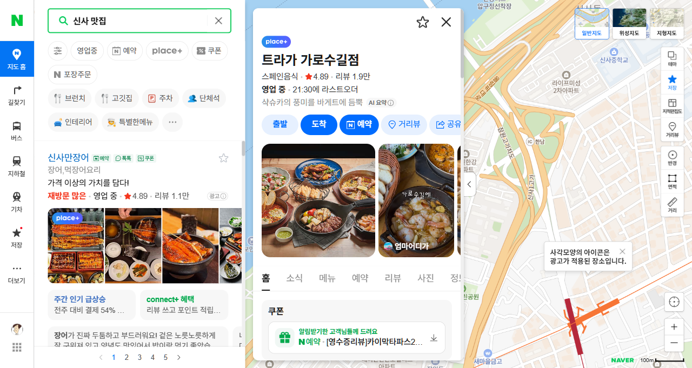
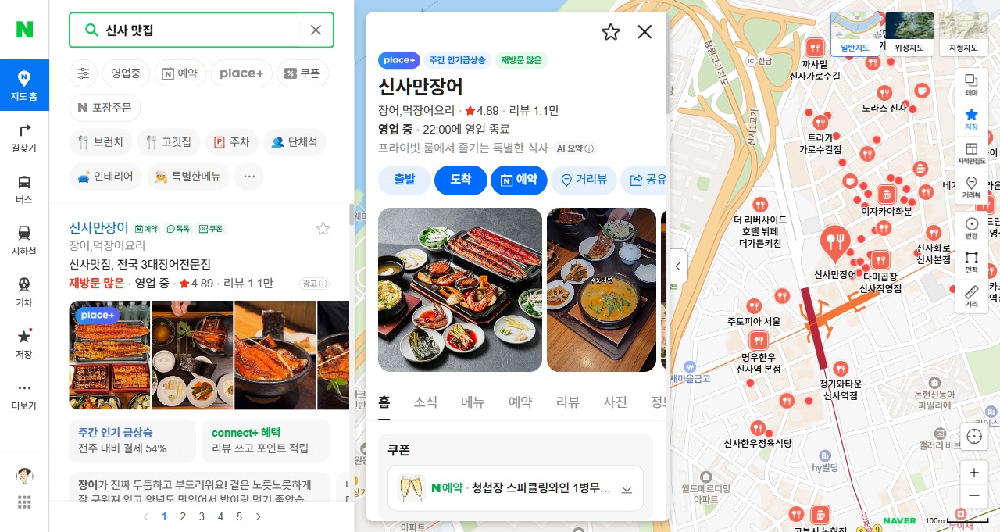
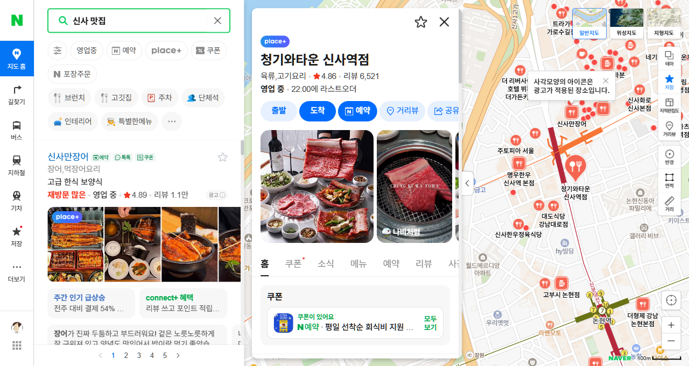

# 신사 맛집 베스트 3 (Playwright 자동 검색)

네이버 검색·플레이스를 통해 방문자 리뷰가 많고 평점이 높은 신사 지역 맛집 3곳을 선정했습니다.

## 1. 트라가 가로수길점 (스페인음식)

- **평점**: ★4.89
- **리뷰**: 1.9만 개
- **특징**: 트라가빠에야, 하몽, 생맥주 등 스페인 요리 전문. 리뷰 수가 압도적으로 많아 대중적으로 검증된 맛집

## 2. 신사만장어 (장어·먹장어요리)

- **평점**: ★4.89
- **리뷰**: 1.1만 개
- **특징**: 고급 한식 보양식 콘셉트의 장어 전문점. 장어덮밥 3대 맛집으로 알려져 있으며 재방문율이 높음

## 3. 청기와타운 신사역점 (육류·고기요리)

- **평점**: ★4.86
- **리뷰**: 6,521개
- **특징**: 회식·모임에 적합한 고기요리 전문점. 네이버 예약 시 회식비 지원 쿠폰 제공

## 요약

| 순위 | 매장 | 카테고리 | 평점 | 리뷰 수 |
|---|---|---|---|---|
| 1 | 트라가 가로수길점 | 스페인음식 | ★4.89 | 1.9만 |
| 2 | 신사만장어 | 장어요리 | ★4.89 | 1.1만 |
| 3 | 청기와타운 신사역점 | 고기요리 | ★4.86 | 6,521 |
