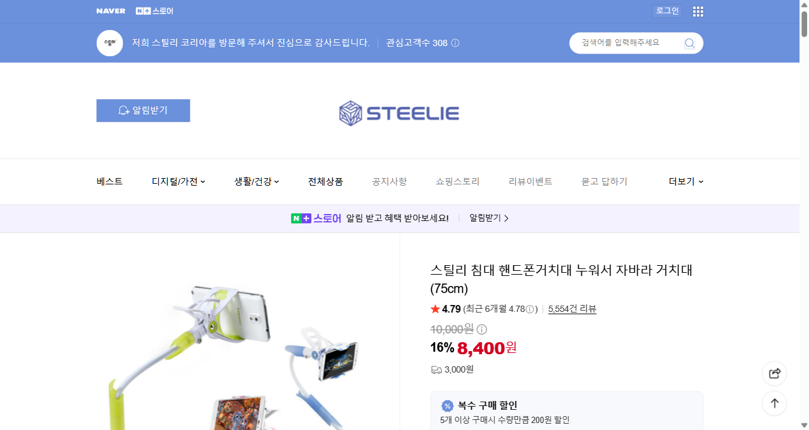
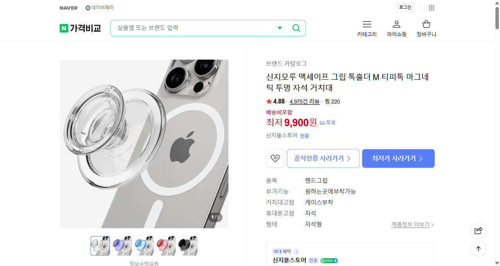
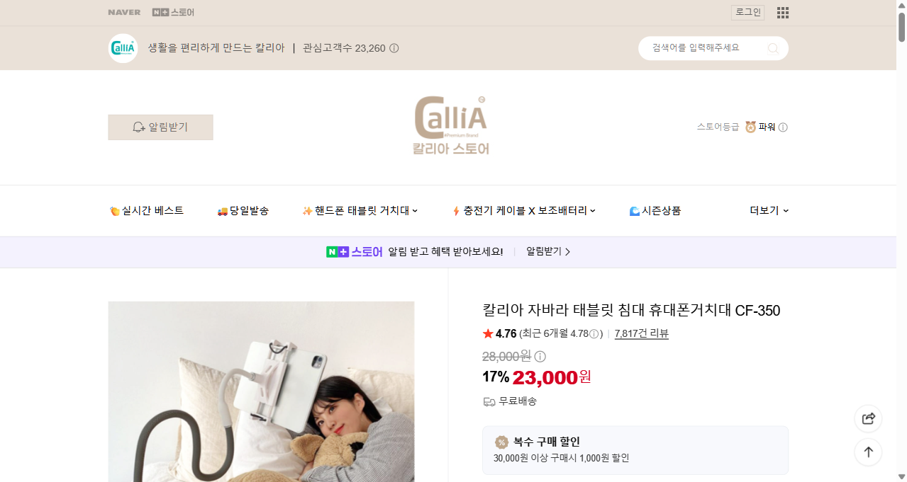

# 핸드폰 거치대 가격 비교 (Playwright 자동 검색)

네이버 검색·가격비교를 통해 가성비 좋은 핸드폰 거치대 3개를 선정했습니다.

## 1. 스틸리 침대 핸드폰거치대 누워서 자바라 거치대 (75cm)

- **가격**: 8,400원 (16% 할인, 정가 10,000원)
- **배송비**: 3,000원
- **평점**: ★4.79 (5,554개 리뷰)
- **판매처**: 스틸리 코리아

## 2. 신지모루 맥세이프 그립 톡홀더 M 티피톡 마그네틱 투명 자석 거치대

- **가격**: 최저 9,900원
- **배송비**: 무료
- **평점**: ★4.88 (4,975개 리뷰)
- **특징**: 가격비교 상 판매처 22곳 중 최저가, 평점이 3개 중 가장 높음

## 3. 칼리아 자바라 태블릿 침대 휴대폰거치대 CF-350

- **가격**: 23,000원 (17% 할인, 정가 28,000원)
- **배송비**: 무료
- **평점**: ★4.76 (7,817개 리뷰)
- **판매처**: 칼리아 스토어 (공식)

## 요약

| 순위 | 제품 | 가격 | 배송비 | 평점 |
|---|---|---|---|---|
| 1 | 스틸리 침대 핸드폰거치대 (75cm) | 8,400원 | 3,000원 | ★4.79 (5,554) |
| 2 | 신지모루 맥세이프 그립 톡홀더 M | 9,900원 | 무료 | ★4.88 (4,975) |
| 3 | 칼리아 자바라 태블릿 침대거치대 CF-350 | 23,000원 | 무료 | ★4.76 (7,817) |
